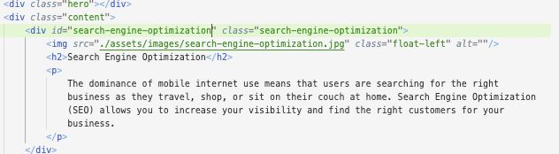
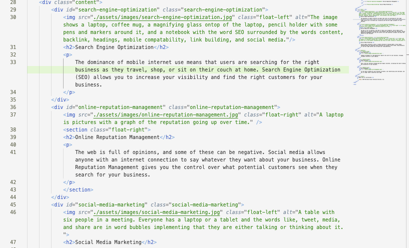
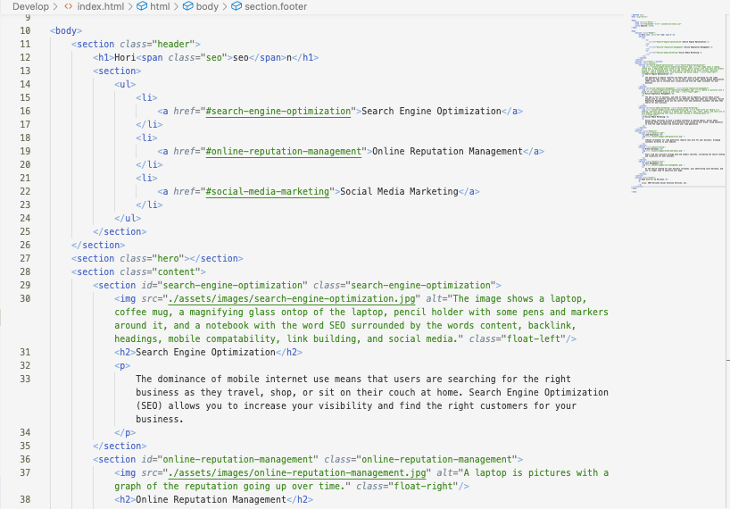

# horiseon-code-refactor

## Description

In this project the goal is to add semantic code in order to make the website more accessible for everyone.
Another key point is making sure all of the links work. 
In this project I learned to troubleshoot links as well as adding sematic to make the webpage more accessible and adding alt text to images incase it fails and for everyone to be able to know whats on the image. 

## Changes Made

In this Screenshot, it shows how I added the id attribute (in the green row) it was missing in order for the link to properly work.

In this image on line 30, 37, and 46 you can see how I added an alt element inside the "image" element to show altnative text incase a user can't see the image or is visually impaired. 

In this image you can see I changed all of the "div"s to "section" (the divs are pictured in the previous images)

## Deployment Link

## Credits
Maria Ortiz

[Github Profile](https://mariaortiz53.github.io/horiseon-code-refactor/)